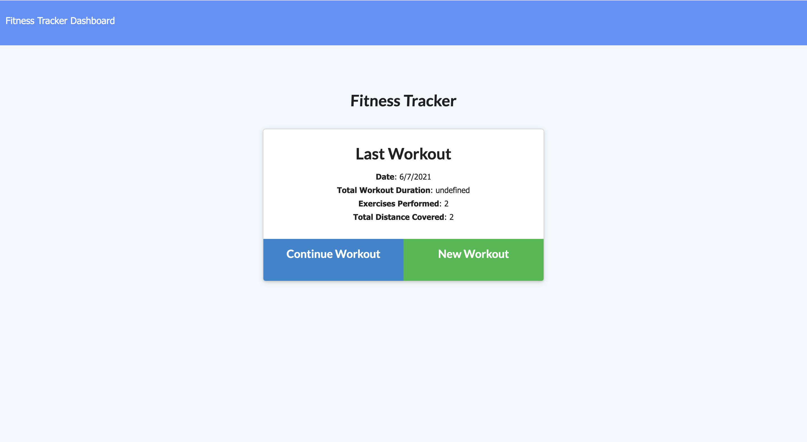
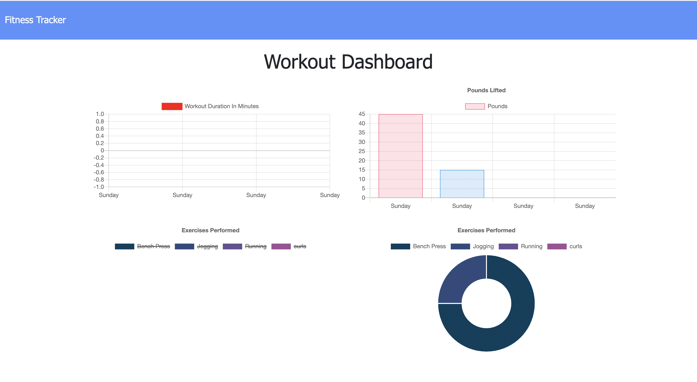

#       Fitness Tracker Powered By MongoDB

#       Description

This application simulates a fitness tracker program that allows the user to define personal workout and fitness goals. Users can select the type, duration, number of repetions, and the amount of sets their workout will consist of. The user's progress is recorded, and is then displayed in a chart setting as a visual guide for the user so they can see and track their milestones throughout their workouts.

#       Images

#       Languages Used

* HTML
* JavaScript
* Node.js
* CSS

#       Dependencies

* mongoose
* express
* morgan

#       Installation

* Clone the repo link to your local computer
* Open your intergraded CLI
* Run npm install
* Run npm run seed
* Run npm start

#       Contributors
 
* Marisa Hanna

#       Link To Delpoyed Application On Heroku

[https://mybadworkouts.herokuapp.com/](https://mybadworkouts.herokuapp.com/)

